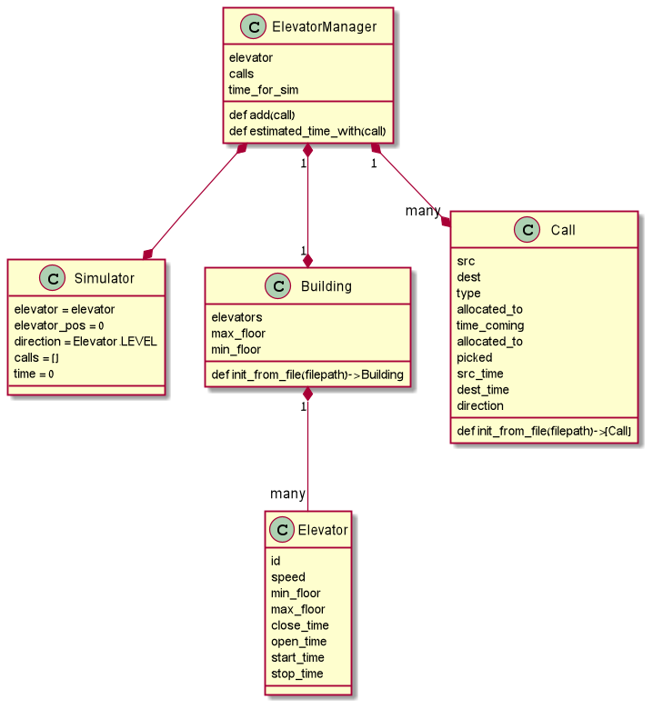

# **Elevator Scheduling**

#### A part of university assignment 

 

## Project Overview
Giving a building with elevators and a set of calls , the program needs to allocate the calls to the elevators 
in a way that minimizes the average waiting time.

### What is needed 
- allocate calls algorithm 
- elevator movement simulation
- parse json/csv files 

 

### Project Structure

 

## How to RUN 

`In the cmd : `

    python Ex1.py B1.json C2.csv out.csv

 

#### Example:

    python3 Ex1.py B5.json Calls_d.csv out_file

**C2 - Elevator calls .csv file** 
 
**B1 - Building json file**

 

## Test Results
    java -jar Ex1_checker_V1.2_obf.jar 1111,2222,3333 B2.json Ex1_Calls_case_2_b.csv out.log

 

## Built With

* Pycharm 
* Python

 

## Algorithm Breakdown

### Allocation algorithm (offline algorithm)
Being an offline algorithm all the elevator calls are given from the start

#### How it works ? 
- Picking the elevator with the best time to get to the given call , taking in considiration the elevator current calls.
- To accomplish the above ,A simulator was used to mimic the elevator behavior and providing the elevator status at a certain time
  
 

### Elevator scheduling
Idea : Keep moving in one direction until possible, then reverse direction , 

- **This scheduling method was used in the simulator**

 
 

 
 

## Authors

* **Tarik Husin**  - linkedin -> https://www.linkedin.com/in/tarik-husin-706754184/
* **Wisam Kabha**  - github -> https://github.com/Wissam111

## References
    
https://towardsdatascience.com/elevator-optimization-in-python-73cab894ad30

https://www.quora.com/What-are-ways-to-optimize-the-service-algorithm-for-an-elevator

